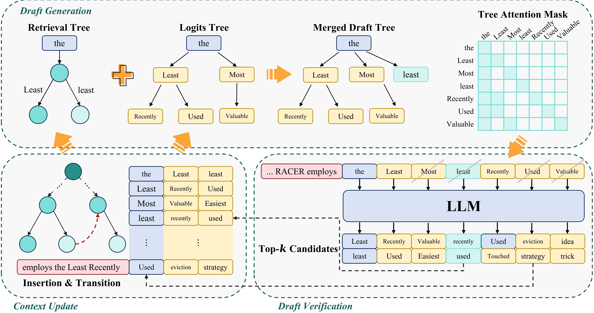

<div align="center">

# 🏎️ RACER

### Retrieval-Augmented Contextual Rapid Speculative Decoding

[](https://www.python.org/)
[](https://pytorch.org/)
[](https://huggingface.co/transformers)
[](LICENSE)



</div>

---

## 📋 Table of Contents

- [Installation](#-installation)
- [Supported LLMs](#-supported-llms)
- [Inference](#-inference)
  - [Evaluation](#evaluation)
  - [Speed Analysis](#speed-analysis)
  - [Free Chat](#free-chat)
- [Acknowledgement](#acknowledgement)

---

## 🛠️ Installation

```bash
conda create -n racer python=3.10
conda activate racer
cd RACER
pip install -r requirements.txt
```

---

## 🤖 Supported LLMs

| Modality | Models |
| --- | --- |
| **📝 Text-only** | OpenPangu \| Qwen3 (Dense / MoE) \| LLaMA 2/3 \| Mixtral |
| **🖼️ Multimodal** | Qwen2.5/3-VL \| LLaVA |

---

## 🚀 Inference

### Evaluation

Run benchmarks to measure mean accepted tokens and speedup ratios:

```bash
# Example: Evaluate Qwen3-1.7B on MGSM-ZH
CUDA_VISIBLE_DEVICES=0 python -m evaluation.inference_racer \
  --model-path qwen/qwen3-1.7b \
  --model-id qwen3-1.7b-racer \
  --bench-name mgsm
```

> **`--bench-name`** accepts: `spec_bench` | `human_eval` | `mgsm` | `gsm8k` | `math` | `aime` | &nbsp;(default: `spec_bench`)

---

### Speed Analysis

Measure decoding throughput and compare against baselines:

```bash
# Single-file speed analysis
python evaluation/speed.py <file_path>

# Compare with a baseline (calculates speedup ratio)
python evaluation/speed.py <file_path> --base <base_path>

# Batch analysis across an entire folder
python evaluation/batch_speed.py <folder> --base <base_path>
```

---

### Free Chat

> Accepted draft tokens (excluding the sampled next token) are highlighted in **green**.

**Terminal CLI**

```bash
CUDA_VISIBLE_DEVICES=0 python -m racer.inference.cli --model-path qwen/qwen3-1.7b

# Optional arguments:
#   --temperature   Sampling temperature  (default: 0.7)
#   --top-p         Nucleus sampling p    (default: 0.8)
```

**Web UI**

```bash
CUDA_VISIBLE_DEVICES=0 python -m racer.inference.webui --model-path qwen/qwen3-1.7b
```

---

## Acknowledgement

We would like to thank [openPangu](https://huggingface.co/openpangu/models) for its support. openPangu is a trademark of Huawei Technologies Co., Ltd. For more information, please refer to the official openPangu repository and the accompanying license files.
